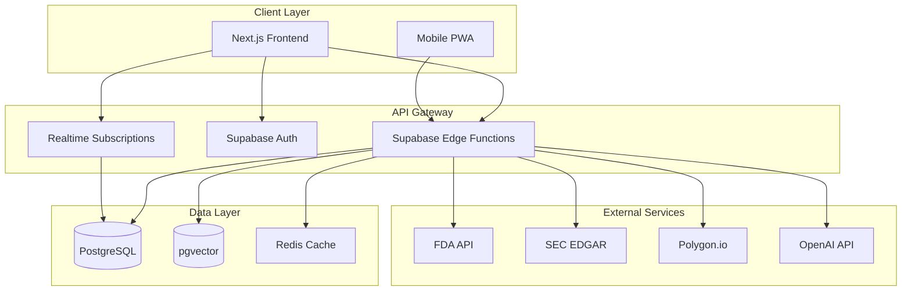
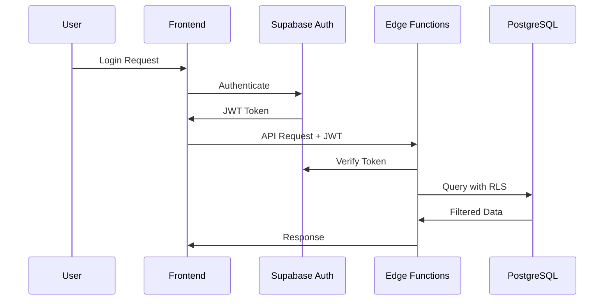

# SignalBoard Architecture

## 🏗️ System Overview

SignalBoard is a modern web application built with a serverless architecture using Supabase as the backend and Next.js for the frontend.



## 🎯 Design Principles

1. **Serverless First**: Minimize operational overhead
2. **Real-time by Default**: WebSocket connections for live updates
3. **Type Safety**: TypeScript throughout the stack
4. **Security First**: RLS policies, CSRF protection, rate limiting
5. **Performance Optimized**: Lazy loading, virtualization, caching

## 🔧 Technology Stack

### Frontend
- **Framework**: Next.js 15.3.3 (App Router)
- **Language**: TypeScript 5.x
- **Styling**: Tailwind CSS v4
- **State Management**: React Context + Zustand
- **Animations**: Framer Motion
- **Data Viz**: D3.js
- **Testing**: Jest + React Testing Library

### Backend
- **Database**: PostgreSQL 15 (Supabase)
- **Edge Functions**: Deno runtime
- **Vector Store**: pgvector extension
- **Authentication**: Supabase Auth
- **Real-time**: Supabase Realtime
- **File Storage**: Supabase Storage

### Infrastructure
- **Hosting**: Vercel (Frontend) + Supabase (Backend)
- **CDN**: Vercel Edge Network
- **Monitoring**: Sentry + Supabase Dashboard
- **CI/CD**: GitHub Actions

## 📊 Data Architecture

### Database Schema

```sql
-- Core Tables
catalysts
├── id (uuid, PK)
├── type (enum: fda, sec, earnings, merger, clinical)
├── ticker (text)
├── title (text)
├── description (text)
├── event_date (timestamptz)
├── impact_score (float)
├── confidence_score (float)
├── source_url (text)
├── metadata (jsonb)
├── embedding (vector(1536))
└── created_at (timestamptz)

user_profiles
├── id (uuid, PK, FK->auth.users)
├── email (text)
├── username (text)
├── role (enum: trader, admin, guest)
├── portfolio_public (boolean)
├── prediction_stats (jsonb)
└── created_at (timestamptz)

predictions
├── id (uuid, PK)
├── user_id (uuid, FK->user_profiles)
├── catalyst_id (uuid, FK->catalysts)
├── direction (enum: up, down, neutral)
├── magnitude (float)
├── confidence (float)
├── rationale (text)
└── created_at (timestamptz)

watchlists
├── id (uuid, PK)
├── user_id (uuid, FK->user_profiles)
├── ticker (text)
├── alerts_enabled (boolean)
└── created_at (timestamptz)
```

### Data Flow

1. **Ingestion Pipeline**:
   ```
   External API → Edge Function → Validation → PostgreSQL → Embeddings → Real-time Broadcast
   ```

2. **Query Pipeline**:
   ```
   Frontend Request → Edge Function → Cache Check → PostgreSQL → Response
   ```

3. **ML Pipeline**:
   ```
   Historical Data → Feature Engineering → XGBoost Model → Predictions → Cache
   ```

## 🔐 Security Architecture

### Authentication Flow


### Security Layers
1. **Network**: HTTPS everywhere, CORS policies
2. **Authentication**: JWT tokens with refresh rotation
3. **Authorization**: Row Level Security (RLS) policies
4. **Input Validation**: Zod schemas, sanitization
5. **Rate Limiting**: Per-user and per-IP limits
6. **CSRF Protection**: Token validation on mutations

## 🚀 Performance Optimizations

### Frontend
- **Code Splitting**: Dynamic imports for routes
- **Image Optimization**: Next.js Image component
- **Virtual Scrolling**: For long catalyst lists
- **Debouncing**: Search and filter inputs
- **Memoization**: Expensive computations

### Backend
- **Connection Pooling**: Supabase handles automatically
- **Query Optimization**: Proper indexes on hot paths
- **Caching Strategy**:
  - Edge Function results (5 min)
  - ML predictions (1 hour)
  - Static assets (1 year)
- **Batch Operations**: Bulk inserts for scrapers

### Real-time Performance
- **Channel Optimization**: One channel per feature
- **Presence Tracking**: Only for active features
- **Message Batching**: Group updates in 100ms windows

## 📱 Frontend Architecture

### Component Hierarchy
```
App
├── Layout
│   ├── Header
│   └── Navigation
├── Pages
│   ├── Dashboard
│   │   ├── Timeline
│   │   ├── Filters
│   │   └── CatalystDetails
│   ├── Predictions
│   │   ├── GameBoard
│   │   └── Leaderboard
│   └── Portfolio
│       ├── Holdings
│       └── Alerts
└── Providers
    ├── AuthProvider
    ├── ThemeProvider
    └── NotificationProvider
```

### State Management
```typescript
// Global State (Zustand)
- User preferences
- Theme settings
- Notification queue

// Context State
- Authentication
- Real-time subscriptions
- Feature flags

// Local State (useState)
- Form inputs
- UI toggles
- Temporary data
```

## 🔄 Data Synchronization

### Real-time Updates
1. **Catalyst Updates**: New catalysts broadcast to all users
2. **Prediction Updates**: User predictions sync across devices
3. **Price Alerts**: Push notifications for watchlist items

### Offline Support (Future)
- Service Worker for offline access
- IndexedDB for local storage
- Background sync for queued actions

## 📈 Scalability Considerations

### Current Limits
- **Database**: 500 GB storage, 50k concurrent connections
- **Edge Functions**: 1M invocations/month
- **Real-time**: 200 concurrent connections
- **Bandwidth**: 250 GB/month

### Scaling Strategy
1. **Vertical**: Upgrade Supabase plan as needed
2. **Horizontal**: Add read replicas for heavy queries
3. **Caching**: Implement Redis for hot data
4. **CDN**: Static assets via Vercel Edge
5. **Sharding**: Partition by date for historical data

## 🔍 Monitoring & Observability

### Metrics Tracked
- **Performance**: Core Web Vitals, API latency
- **Business**: User signups, prediction accuracy
- **Technical**: Error rates, database performance
- **Security**: Failed auth attempts, rate limit hits

### Alerting Rules
- API response time > 2s
- Error rate > 1%
- Database CPU > 80%
- Failed scrapers > 2 consecutive

## 🚧 Future Architecture Improvements

1. **Microservices Migration**: Split scrapers into separate services
2. **Event Sourcing**: For prediction history and audit trail
3. **GraphQL Gateway**: For flexible client queries
4. **ML Pipeline**: Dedicated infrastructure for model training
5. **Multi-region**: Deploy to multiple regions for lower latency