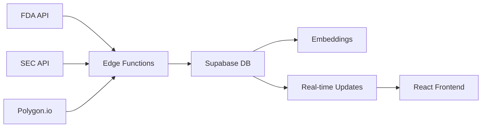

# SignalBoard 🚀

A futuristic event-driven trading platform that helps traders anticipate and act on stock price catalysts through visual timelines, predictive analytics, and gamified forecasting.


## 🎯 Vision

SignalBoard transforms how traders prepare for market-moving events by:
- **Visualizing** upcoming catalysts on an interactive timeline
- **Predicting** price movements with ML-powered analytics
- **Gamifying** market predictions to improve trading intuition
- **Personalizing** alerts based on portfolio holdings

## 🚀 Quick Start

### Prerequisites
- Node.js 18+
- Supabase CLI
- API Keys (see [API_KEYS_SETUP.md](API_KEYS_SETUP.md))

### Backend Setup (Supabase)

```bash
# Install Supabase CLI
npm install -g supabase

# Link to project
supabase link --project-ref yjaxznsrysvazxqtvcvm

# Apply database migrations
supabase db push

# Deploy Edge Functions
supabase functions deploy --all
```

### Frontend Setup

```bash
cd frontend
npm install
cp .env.example .env.local
# Update .env.local with your Supabase credentials
npm run dev
```

Visit [http://localhost:3000](http://localhost:3000) to see the app.

## 📊 Current Status

**Phase 1-5 ✅ Complete**: 
- Backend Infrastructure with Supabase
- 5 Edge Functions for data ingestion (FDA, SEC, Earnings, ML predictions)
- Timeline UI with glass morphism design
- Authentication system with session management
- ML predictions with XGBoost pipeline
- Real-time WebSocket updates
- Testing infrastructure and code quality tools

**Phase 6 🚧 In Progress**: Testing & Documentation
- Comprehensive unit test coverage (target 80%)
- User onboarding flow
- Tutorial system
- Production deployment preparation

## 🏗️ Architecture

```
SignalBoard/
├── supabase/          # Backend (Edge Functions, DB)
│   ├── functions/     # Data scrapers & processors
│   └── migrations/    # Database schema
├── frontend/          # React + Next.js UI
├── scripts/           # Setup & utility scripts
└── docs/             # Documentation
```

### Data Pipeline


## 🔑 Key Features

### MVP Features (Current Focus)
- **Catalyst Timeline**: Visual representation of upcoming market events
- **FDA Adverse Events**: Track drug safety issues affecting pharma stocks
- **SEC Filings**: Monitor 8-K, 10-K, S-1 filings in real-time
- **Earnings Calendar**: Upcoming earnings with impact predictions

### Coming Soon
- **ML Predictions**: Price movement forecasts with confidence bands
- **Prediction Game**: Compete with other traders on catalyst outcomes
- **Portfolio Integration**: Personalized alerts for your holdings

## 🛠️ Tech Stack

- **Backend**: Supabase (PostgreSQL + Edge Functions)
- **Frontend**: React 18 + Next.js 14 + TypeScript
- **ML/AI**: OpenAI Embeddings + Custom prediction models
- **Real-time**: Supabase Realtime subscriptions
- **Styling**: Tailwind CSS + Glass morphism design

## 📚 Documentation

- [Product Requirements](SignalBoard_prd.md) - What we're building
- [Development Guide](CLAUDE.md) - How we're building it
- [Supabase Implementation](SUPABASE_IMPLEMENTATION.md) - Backend details
- [API Keys Setup](API_KEYS_SETUP.md) - External service configuration
- [TODO List](TODO.md) - Current tasks and roadmap

## 🤝 Contributing

This is currently a private project in active development. If you have access:

1. Check [TODO.md](TODO.md) for current tasks
2. Follow patterns in [CLAUDE.md](CLAUDE.md)
3. Test locally before deploying
4. Document any gotchas in implementation guides

## 🚨 Important Notes

- **API Keys**: Never commit API keys. Use [API_KEYS_SETUP.md](API_KEYS_SETUP.md)
- **FDA Data**: May be 2-3 months behind. We handle this with fallback logic
- **Rate Limits**: Be mindful of API rate limits, especially Polygon.io

## 📈 Roadmap

### Phase 1: Foundation ✅
- Data pipeline setup
- Core database schema
- API integrations

### Phase 2: MVP UI 🚧
- Timeline visualization
- Catalyst details
- Basic predictions

### Phase 3: ML & Gaming
- Prediction models
- Gamification mechanics
- Leaderboards

### Phase 4: Portfolio Integration
- Broker connections
- Personalized alerts
- Risk analysis

## 🔒 Security

- All API keys stored securely in Supabase
- Row Level Security (RLS) enabled
- Service role keys never exposed to frontend

## 📝 License

Private - All rights reserved

---

Built with ❤️ for traders who think ahead